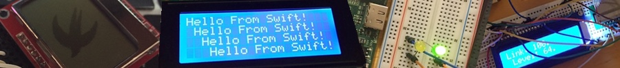

**A Swift library to interact with Linux GPIOs/SPI/I2C/PWM/UART, blinking leds and much more!**


[](#) 
[](https://raw.githubusercontent.com/uraimo/SwiftyGPIO/master/LICENSE) 
[](https://developer.apple.com/swift) 
[](https://github.com/apple/swift-package-manager)
[](https://slackpass.io/swift-arm)




## Summary

This library provides an easy way to interact with external sensors and devices using digital GPIOs, SPI interfaces, PWM signals and serial ports with Swift on Linux.

You'll be able to configure port attributes (direction,edge,active low), read/write the current GPIOs value, use the SPI interfaces (via hardware if your board provides them or using software big-banging SPI), comunicate over a bus with I2C, generate a PWM to drive external displays, servos, leds and more complex sensors, and finally interact with devices that expose UART serial connections using AT commands or custom protocols. See the *[libraries](#libraries)* for some device libraries built using SwiftyGPIO.

The library is built to run **exclusively on Linux ARM Boards** (RaspberryPis, BeagleBone Black, CHIP, etc...) with accessible GPIOs.

##### Content:
- [Supported Boards](#supported-boards)
- [Installation](#installation)
- [Your First Project: Blinking Leds And Sensors](#your-first-project-blinking-leds-and-sensors)
- [Usage](#usage)
    - [GPIO](#gpio)
    - [SPI](#spi)
    - [I2C](#i2c)
    - [PWM](#pwm)
    - [Pattern-based signal generator via PWM](#pattern-based-signal-generator-via-pwm)
    - [UART](#uart)
- [Examples](#examples)
- [Built with SwiftyGPIO](#built-with-swiftygpio)
    - [Device Libraries](#libraries)
    - [Awesome Projects](#awesome-projects)
- [Additional documentation](#additional-documentation)


## Supported Boards

Tested:
* C.H.I.P.
* BeagleBone Black (Thanks to [@hpux735](https://twitter.com/hpux735))
* Raspberry Pi 2 (Thanks to [@iachievedit](https://twitter.com/iachievedit))
* Raspberry Pi 3
* Raspberry Pi Zero (Thanks to [@MacmeDan](https://twitter.com/MacmeDan))
* Raspberry Pi Zero W
* Raspberry Pi A,B Revision 1
* Raspberry Pi A,B Revision 2
* Raspberry Pi A+, B+
* OrangePi (Thanks to [@colemancda](https://github.com/colemancda))
* OrangePi Zero (Thanks to [@eugeniobaglieri](https://github.com/eugeniobaglieri)) 
* UDOOs (Thanks to [@estebansannin](https://github.com/estebansannin))

Not tested but they should work(basically everything that has an ARMv7/Ubuntu14/Raspbian or an ARMv6/Raspbian):
* BananaPi
* OLinuXinos
* ODROIDs
* Cubieboards
* Tegra Jetson TK1


## Installation

To use this library, you'll need a Linux ARM(ARMv7 or ARMv6) board with Swift 3+.

If you have a RaspberryPi (A,B,A+,B+,Zero,ZeroW,2,3) with Ubuntu or Raspbian, get Swift 3.1.1 from [here](https://www.uraimo.com/2017/05/01/An-update-on-Swift-3-1-1-for-raspberry-pi-zero-1-2-3/) or follow the instruction from the post and the linked [build scripts repository](https://github.com/uraimo/buildSwiftOnARM) to build it yourself.

The same Ubuntu binaries could work for BeagleBoneBlack, C.H.I.P. or any other ARMv6/ARMv7 board too when used with the same release.

If your version of Swift supports the SPM, you just need to add SwiftyGPIO as a dependency in your `Package.swift`:

```swift
let package = Package(
    name: "MyProject",
    dependencies: [
        .Package(url: "https://github.com/uraimo/SwiftyGPIO.git", majorVersion: 0),
        ...
    ]
    ...
)
```
And then build with `swift build`.

The compiler will create an executable under `.build/`.

If your version of Swift does not support the Swift Package Manager, download manually all the needed files: 

    wget https://raw.githubusercontent.com/uraimo/SwiftyGPIO/master/Sources/SwiftyGPIO.swift https://raw.githubusercontent.com/uraimo/SwiftyGPIO/master/Sources/Presets.swift https://raw.githubusercontent.com/uraimo/SwiftyGPIO/master/Sources/SunXi.swift https://raw.githubusercontent.com/uraimo/SwiftyGPIO/master/Sources/SPI.swift https://raw.githubusercontent.com/uraimo/SwiftyGPIO/master/Sources/PWM.swift https://raw.githubusercontent.com/uraimo/SwiftyGPIO/master/Sources/Mailbox.swift https://raw.githubusercontent.com/uraimo/SwiftyGPIO/master/Sources/I2C.swift https://raw.githubusercontent.com/uraimo/SwiftyGPIO/master/Sources/UART.swift

And once downloaded, in the same directory create an additional file that will contain the code of your application named `main.swift`. 

When your code is ready, compile it (every functionality is modularized in a different file, so that the PWM, SPI, I2C, UART files can be deleted if you don't need them) with:

    swiftc *.swift
    
The compiler will create a **main** executable.

**IMPORTANT:** As everything interacting with GPIOs via sysfs/mmapped registers, if your OS does not come with a predefined user group to access these functionalities, you'll need to run your application with root privileges using `sudo ./main`. If you are using a RaspberryPi with a recent Raspbian (post November 2016) or a recent Ubuntu (from 16.04 Xenial onward) implementing /dev/gpiomem, this will be not required to use basic GPIOs, just launch your application with `./main`.

On misconfigured systems, features like the listeners may require root privileges anyway. Advanced features like PWM still require root privileges.

Alternatively, a specific user group for gpio access can be configured manually as shown [here](https://arcanesciencelab.wordpress.com/2016/03/31/running-rpi3-applications-that-use-gpio-without-being-root/) or in this [answer on stackoverflow](https://stackoverflow.com/questions/30938991/access-gpio-sys-class-gpio-as-non-root/30940526#30940526).
After following those instruction, remember to add your user (e.g. pi) to the gpio group with `sudo usermod -aG gpio pi` and to reboot so that the changes you made are applied.

<a href="#first"></a>
## Your First Project: Blinking leds and sensors

If you prefer starting with a real project instead of just reading documentation, more than a few tutorials are available online.

If you are using Swift 3.0 and the latest version of SwiftyGPIO, [Cameron Perry has a great step by step guide](http://mistercameron.com/2016/06/accessing-raspberry-pi-gpio-pins-with-swift/) on how to setup a Raspberry Pi for Swift and using a led and a temperature sensor. 

If you are still using Swift 2.x and need a practical example of how to use SwiftyGPIO (get it from [the specific 2.x branch](https://github.com/uraimo/SwiftyGPIO/tree/swift-2.2)), Joe from iachievedit has written a [fantastic tutorial](http://dev.iachieved.it/iachievedit/raspberry-pi-2-gpio-with-swiftygpio/) that will explain everything you need to know.

Additional tutorials are also available in [中文](http://swift.gg/2016/04/01/raspberry-pi-2-gpio-with-swiftygpio/), [日本語](https://ja.ngs.io/2016/06/01/swifty-gpio/) and [Tiếng Việt](https://techmaster.vn/posts/34237/lap-trinh-swift-tren-raspberry-pi).

## Usage

Currently, SwiftyGPIO expose GPIOs, SPIs(if not available a bit-banging VirtualSPI can be created), I2Cs, PWMs and UART ports, let's see how to use them.

### GPIO

Let's suppose we are using a Raspberry 2 board and have a led connected between the GPIO pin P2 (possibly with a resistance of 1K Ohm or so) and GND and we want to turn it on.

Note that SwiftyGPIO uses the raw Broadcom numbering scheme ([described here](https://github.com/uraimo/SwiftyGPIO/wiki/GPIO-Pinout)) to assign a number to each pin.

First, we need to retrieve the list of GPIOs available on the board and get a reference to the one we want to modify:

```swift
let gpios = SwiftyGPIO.GPIOs(for:.RaspberryPi2)
var gp = gpios[.P2]!
```

The following are the possible values for the predefined boards:
    
* .RaspberryPiRev1 (Pi A,B Revision 1, pre-2012, 26 pin header)
* .RaspberryPiRev2 (Pi A,B Revision 2, post-2012, 26 pin header) 
* .RaspberryPiPlusZero (Raspberry Pi A+ and B+, Raspberry Zero/W, all with a 40 pin header)
* .RaspberryPi2 (Raspberry Pi 2 with a 40 pin header)
* .RaspberryPi3 (Raspberry Pi 2 with a 40 pin header)
* .BeagleBoneBlack (BeagleBone Black)
* .CHIP (the $9 C.H.I.P. computer).
* .BananaPi (RaspberryPi clone)
* .OrangePi

The map returned by `GPIOs(for:)` contains all the GPIOs of a specific board as described by [these diagrams](https://github.com/uraimo/SwiftyGPIO/wiki/GPIO-Pinout). 

Alternatively, if our board is not supported, each single GPIO object can be instantiated manually, using its SysFS GPIO Id:

```swift
var gp = GPIO(name: "P2",id: 2)  // User defined name and GPIO Id
```
    
The next step is configuring the port direction, that can be either `GPIODirection.IN` or `GPIODirection.OUT`, in this case we'll choose .OUT:

```swift
gp.direction = .OUT
```

Then we'll change the pin value to the HIGH value "1":

```swift
gp.value = 1
```

That's it, the led will turn on.

Now, suppose we have a switch connected to P2 instead, to read the value coming in the P2 port, the direction must be configured as `.IN` and the value can be read from the `value` property:

```swift
gp.direction = .IN
let current = gp.value
```

The other properties available on the GPIO object (edge,active low) refer to the additional attributes of the GPIO that can be configured but you will not need them most of the times. For a detailed description refer to the [kernel documentation](https://www.kernel.org/doc/Documentation/gpio/sysfs.txt)

GPIOs also support the execution of closures when the value of the pin changes. Closures can be added with `onRaising` (the pin value changed from 0 to 1), `onFalling` (the value changed from 1 to 0) and `onChange` (the value simply changed from the previous one):

```swift
let gpios = SwiftyGPIO.GPIOs(for:.RaspberryPi2)
var gp = gpios[.P2]!


gp.onRaising{
    gpio in
    print("Transition to 1, current value:" + String(gpio.value))
}
gp.onFalling{
    gpio in
    print("Transition to 0, current value:" + String(gpio.value))
}
gp.onChange{
    gpio in
    gpio.clearListeners()
    print("The value changed, current value:" + String(gpio.value))
}  
```

The closure receives as its only parameter a reference to the GPIO object that has been updated so that you don't need to use the external variable.
Calling `clearListeners()` removes all the closures listening for changes and disables the changes handler.
While GPIOs are checked for updates, the `direction` of the pin cannot be changed (and configured as `.IN`), but once the listeners have been cleared, either inside the closure or somewhere else, you are free to modify it.
 

### SPI

If your board has a SPI connection and SwiftyGPIO has it among its presets, a list of the available SPI channels can be obrained calling `hardwareSPIs(for:)` with one of the predefined boards.

On RaspberryPi and other boards the hardware SPI SysFS interface is not enabled by default, check out the setup guide on [wiki](https://github.com/uraimo/SwiftyGPIO/wiki/Enabling-SPI-on-RaspberryPi-and-others).

Let's see some examples using a RaspberryPi 2 that has one bidirectional SPI, managed by SwiftyGPIO as two mono-directional SPIObjects:
 
```swift
let spis = SwiftyGPIO.hardwareSPIs(for:.RaspberryPi2)!
var spi = spis[0]
```

The items returned refer to different devices addressable through the SPI bus, the number is equal to the number of CS(or CE) pins available on your board.

Alternatively, we can create a software SPI using four GPIOs, one that will serve as clock pin (SCLK), one as chip-select (CS or CE) and the other two will be used to send and receive the actual data (MOSI and MISO). This kind of bit-banging SPI is slower than the hardware one, so, the recommended approach is to use hardware SPIs when available.

To create a software SPI, just retrieve two pins and create a `VirtualSPI` object:
```swift
let gpios = SwiftyGPIO.GPIOs(for:.RaspberryPi2)
var cs = gpios[.P27]!
var mosi = gpios[.P22]!
var miso = gpios[.P4]!
var clk = gpios[.P17]!

var spi = VirtualSPI(mosiGPIO: mosi, misoGPIO: miso, clockGPIO: clk, csGPIO: cs)
```

Both objects implement the same `SPIObject` protocol and so provide the same methods.
To distinguish between hardware and software SPIObjects, use the `isHardware` method.

To send one or more byte over a SPI, use the `sendData` method.
In its simplest form it just needs an array of UInt8 as parameter:

```swift
spi?.sendData([UInt(42)], frequencyHz: 500_000)
```

The frequency at which the data will be sent can be specified if needed (alternatively the default will be used, that is 500khz for hardware SPIs and the best available speed for virtual SPIs).

Since the interface performs only full duplex transmissions, to read some data from the SPI you'll need to write the same amount of bits. For most devices you'll use this means that you'll need to send some dummy data depending on the protocol used by your device. Check the device reference for more information.

Let's see a simple example, that reads 32 bytes from a device sending just 32 empty bytes:

```swift
let data: [UInt8] = [UInt8](repeating:0, count: 32)
let res = spi?.sendData(data)
```
The `res` array will contain the raw data received from the device. Again, what to send and how the received data should be interpreted depends from the device or IC you are using, always read the reference manual.

### I2C

The I2C interface can be used to communicate using the SMBus protocol on a I2C bus, reading or writing registers on devices identified by a numerical address. This interface needs just two wires (clock and data) and unlike SPI, it does not need a dedicated chip select/enable wire to select which device will receive the signal being sent, since the address of the destination of the protocol's messages is contained in the message itself, quite an improvement.

To obtain a reference to the `I2CInterface` object, call the `hardwareI2Cs(for:)` utility method of the SwiftyGPIO class:

```swift
let i2cs = SwiftyGPIO.hardwareI2Cs(for:.RaspberryPi2)!
let i2c = i2cs[1]
```

This object provide methods to read and write registers of different sizes and to verify that a device at a certain address is reachable or to enable a CRC on the protocol's messages:

```swift
func isReachable(_ address: Int) -> Bool
func setPEC(_ address: Int, enabled: Bool)
```

You should choose the read method to use depending on the fact that your device supports multiple registers (`command` in SMBus parlance) and depending of the size of the register you are going to read from:

```swift
func readByte(_ address: Int) -> UInt8
func readByte(_ address: Int, command: UInt8) -> UInt8
func readWord(_ address: Int, command: UInt8) -> UInt16
func readData(_ address: Int, command: UInt8) -> [UInt8]
```

Let's suppose that we want to read the seconds register (id 0) from a DS1307 RTC clock, that has an I2C address of 0x68:

```swift
print(i2c.readByte(0x68, command: 0)) //Prints the value of the 8bit register
```

You should choose the same way one of the write functions available, just note that `writeQuick` is used to perform quick commands and does not perform a normal write. SMBus's quick commands are usually used to turn on/off devices or perform similar tasks that don't require additional parameters.

```swift
func writeQuick(_ address: Int)

func writeByte(_ address: Int, value: UInt8)
func writeByte(_ address: Int, command: UInt8, value: UInt8)
func writeWord(_ address: Int, command: UInt8, value: UInt16)
func writeData(_ address: Int, command: UInt8, values: [UInt8])
```

While using the I2C functionality doesn't require additional software to function, the tools contained in `i2c-tools` are useful to perform I2C transactions manually to verify that everything is working correctly.

For example, I recommend to always check if your device has been connected correctly running `i2cdetect -y 1`. More information on I2C, and configuration instruction for the Raspberry Pi, are available [on Sparkfun](https://learn.sparkfun.com/tutorials/raspberry-pi-spi-and-i2c-tutorial).  

The `Example/` directory contains a Swift implementation of *i2cdetect* and could be a good place to start experimenting.

### PWM

PWM output signals can be used for example to drive servo motors, RGB leds and other devices, or more in general, to approximate analog output values when you only have digital GPIO ports.

If your board has PWM ports and is supported (at the moment only RaspberryPi boards), retrieve the available `PWMOutput` objects with the `hardwarePWMs` factory method:

```swift
let pwms = SwiftyGPIO.hardwarePWMs(for:.RaspberryPi2)!
let pwm = (pwms[0]?[.P18])!
```

This method returns all the ports that support the PWM function, grouped by the PWM channel that controls them. 

You'll be able to use only one port per channel and considering that the Raspberries have two channels, you'll be able to use two PWM outputs at the same time, for example GPIO12 and GPIO13 or GPIO18 and GPIO19.

Once you've retrieved the `PWMOutput` for the port you plan to use you need to initialize it to select the PWM function. On this kind of boards, each port can have more than one function (simple GPIO, SPI, PWM, etc...) and you can choose the function you want configuring dedicated registers.

```swift
pwm.initPWM()
```

To start the PWM signal call `startPWM` providing the period in nanoseconds (if you have the frequency convert it with 1/frequency) and the duty cycle as a percentage:

```swift
print("PWM from GPIO18 with 500ns period and 50% duty cycle")
pwm.startPWM(period: 500, duty: 50)
```

Once you call this method, the PWM subsystem of the ARM SoC will start generating the signal, you don't need to do anything else and your program will continue to execute, you could insert a `sleep(seconds)` here if you just want to wait.

And when you want to stop the PWM signal call the `stopPWM()` method:

```swift
pwm.stopPWM()
```

If you want to change the signal being generated, you don't need to stop the previous one, just call `startPWM` with different parameters.

This feature uses the M/S algorithm and has been tested with signals with a period in a range from 300ns to 200ms, generating a signal outside of this range could lead to excessive jitter that could not be acceptable for some applications. If you need to generate a signal near to the extremes of that range and have an oscilloscope at hand, always verify if the resulting signal is good enough for what you need.

### Pattern-based signal generator via PWM

<p>


</p>
  
This functionality leverages the PWM to generate digital signals based on two patterns representing a 0 or a 1 value through a variation of the duty cycle. Let's look at a practical example to better understand the use case and how to use this signal generator:

Let's consider for example the WS2812, a led with integrated driver used in many led strips.

This led is activated with a signal between 400Khz and 800Khz containing the encoded value of three bytes representing respectively the *Green*,*Blue* and *Red* color values. Each bit composing the byte of each one of the color components has to be encoded this way:

* Bit value 0: _A 1250ns signal that stays, at least, high for 350ns(T0H) and then low for 900ns(T0L), with a tollerance of 150ns._
* Bit value 1: _A 1250ns signal that stays,at least, high for 650ns(T1H) and then low for 600ns(T0L), with a tollerance of 150ns._

For each byte you'll have to send a sequence of 8 bit encoded this way and three bytes will be needed to configure the color of every led. If you have more than one led connected to each other serially, you'll just need to send a series of 3 bytes values. Once the whole sequence of colors for your strip of leds has been sent, you need to keep the voltage at 0 for 50us, before you'll be able to transmit a new sequence.

The bytes we'll send will configure the leds of the strip starting from the last one, going backwards to the first one.

This diagram from the official documentation gives you a better idea of what those signals look like:


  
You could think to just send this signal based on those 0 and 1 pattern changing the values of a GPIO, but that's actually impossible for an ARM board to keep up with the rate required by devices like the WS2812 leds. Once the period of the pattern is lower than 100us or so, you need another way to send your signal. Ant this is what the pattern-based signal generator solves, leveraging PWM-capable outputs.

You'll find a complete example under `Examples/PWMPattern`, but let's describe each one of the steps needed to use this feature. 

In this brief guide I'm using an 8x8 led matrix with 64 WS2812 leds (these matrices are usually marketed as NeoPixel matrix, Nulsom Rainbow matrix, etc... and you can find one of these in some Pimoroni products like the UnicornHat).

First of all let's retrieve a `PWMOutput` object and then initialize it:

```swift
let pwms = SwiftyGPIO.hardwarePWMs(for:.RaspberryPi2)!
let pwm = (pwms[0]?[.P18])!

// Initialize PWM
pwm.initPWM()
```

We'll then configure the signal generator specifying the frequency we need (800KHz for a 1250ns pattern period), the number of leds in the sequence (I'm using and 8x8 led matrix here), and the duration of the reset time (55us). We'll call the `initPWMPattern` to configure these parameters. We specify the duty cycle (percentage of the period at which the pattern should have a high value) for the 0 and 1 values.

```swift
let NUM_ELEMENTS = 64
let WS2812_FREQ = 800000 // 800Khz
let WS2812_RESETDELAY = 55  // 55us reset

pwm.initPWMPattern(bytes: NUM_ELEMENTS*3, 
                   at: WS2812_FREQ, 
                   with: WS2812_RESETDELAY, 
                   dutyzero: 33, dutyone: 66) 
```

Once this is done, we can start sending data, this time we are using a function that sets the colors and another function that turn them in a series of `UInt8` in the `GBR` format:

```swift
func toByteStream(_ values: [UInt32]) -> [UInt8]{
    var byteStream = [UInt8]()
    for led in values {
        // Add as GRB, converted from RGB+0x00
        byteStream.append(UInt8((led >> UInt32(16))  & 0xff))
        byteStream.append(UInt8((led >> UInt32(24)) & 0xff))
        byteStream.append(UInt8((led >> UInt32(8))  & 0xff))
    }
    return byteStream
}

var initial = [UInt32](repeating:0x50000000, count:NUM_ELEMENTS)
var byteStream: [UInt8] = toByteStream(initial)

pwm.sendDataWithPattern(values: byteStream)
```

The method `sendDataWithPatter` will use the sequence of `UInt8` to produce a signal composed by the patterns described above.

We can then wait until the signal is completely sent and then perform the necessary final cleanup:

```swift
// Wait for the transmission to end
pwm.waitOnSendData()

// Clean up once you are done with the generator
pwm.cleanupPattern()
```

At this point you could configure a different signal calling again `initPWMPattern` if you want to.

### UART

If your board support the UART serial ports feature (disable the login on serial with `raspi-config` for RaspberryPi boards), you can retrieve the list of available `UARTInterface` with `SwiftyGPIO.UARTs(for:)`:

```swift
let uarts = SwiftyGPIO.UARTs(for:.RaspberryPi2)!
var uart = uarts[0]
```

Before we can start trasmitting data, you need to configure the serial port, specifying: the speed (from 9600bps to 115200bps), the character size (6,7 or 8 bits per character), the number of stop bits (1 or 2) and the parity of your signal (no parity, odd or even). Software and hardware flow control are both disabled when using this library.

```swift
uart.configureInterface(speed: .S9600, bitsPerChar: .Eight, stopBits: .One, parity: .None)
```

Once the port is configured you can start reading or writing strings of sequence of `UInt8` with one of the specific methods of `UARTInterface`:

```swift
func readString() -> String
func readData() -> [CChar]
func writeString(_ value: String)
func writeData(_ values: [CChar])

func readLine() -> String
```

A specific method that reads lines of text (`\n` is used as line terminator, the serial read is still non-canonical) is also provided.


## Examples

Examples for different boards and functionalities are available in the *Examples* directory, you can just start from there modifying one of those.

The following example, built to run on the C.H.I.P. board, shows the current value of all the attributes of a single GPIO port, changes direction and value and then shows again a recap of the attributes:

```Swift
let gpios = SwiftyGPIO.GPIOs(for:.CHIP)
var gp0 = gpios[.P0]!
print("Current Status")
print("Direction: "+gp0.direction.rawValue)
print("Edge: "+gp0.edge.rawValue)
print("Active Low: "+String(gp0.activeLow))
print("Value: "+String(gp0.value))

gp0.direction = .OUT
gp0.value = 1

print("New Status")
print("Direction: "+gp0.direction.rawValue)
print("Edge: "+gp0.edge.rawValue)
print("Active Low: "+String(gp0.activeLow))
print("Value: "+String(gp0.value))
```

This second example makes a led blink with a frequency of 150ms:

```Swift
import Glibc

let gpios = SwiftyGPIO.GPIOs(for:.CHIP)
var gp0 = gpios[.P0]!
gp0.direction = .OUT

repeat{
	gp0.value = (gp0.value == 0) ? 1 : 0
	usleep(150*1000)
}while(true) 
```

We can't test the hardware SPI with the CHIP but SwiftyGPIO also provide a bit banging software implementation of a SPI interface, you just need two GPIOs to initialize it:

```Swift
let gpios = SwiftyGPIO.GPIOs(for:.CHIP)
var sclk = gpios[.P0]!
var dnmosi = gpios[.P1]!

var spi = VirtualSPI(dataGPIO:dnmosi,clockGPIO:sclk) 

pi.sendData([UInt8(truncatingBitPattern:0x9F)]) 
```

Notice that we are converting the 0x9F `Int` using the constructor `UInt8(truncatingBitPattern:)`, that in this case it's not actually needed, but it's recommended for every user-provided or calculated integer because Swift does not support implicit truncation for conversion to smaller integer types, it will just crash if the `Int` you are trying to convert does not fit in a `UInt8`.

## Built with SwiftyGPIO

A few projects and libraries built using SwiftyGPIO. Have you built something that you want to share? Let me know!

### Libraries
* [Nokia5110(PCD8544) LCD Library](http://github.com/uraimo/5110lcd_pcd8544.swift) - Show text and graphics on a Nokia 3110/5110 LCD display.
* [HD44780U Character LCD Library](https://github.com/uraimo/HD44780CharacterLCD.swift) - Show text on character LCDs controlled by the HD44780 or one of its clones.
* [DHTxx Temperature Sensor Library](https://github.com/pj4533/dhtxx) - Read temperature and humidity values from sensors of the DHT family (DHT11, DHT22, AM2303).
* [SG90 Servo Motor Library](https://github.com/uraimo/SG90Servo.swift) - Drives a SG90 servo motor via PWM but can be easily modified to use other kind of servos.
* [MCP3008 10 bits ADC Library](https://github.com/uraimo/MCP3008.swift) - Convert analog values to integers with this SPI-driven ADC.
* [WS281x Library](https://github.com/uraimo/WS281x.swift) - A library for WS2812x (WS2811,WS2812,WS2812B) RGB led strips, rings, sticks, matrices, etc...
* [u-Blox GPS Receivers Library](https://github.com/uraimo/UBloxGPS.swift) - Get location data from boards with the u-Blox 6/7/8 family of A-GPS receivers with an UART serial connection (e.g. NEO6M).


### Awesome Projects 
* [Portable Wifi Monitor in Swift](http://saygoodnight.com/2016/04/05/portable-wifimon-raspberrypi.html) - A battery powered wifi signal monitor to map your wifi coverage.
* [Temperature & Humidity Monitor in Swift](http://saygoodnight.com/2016/04/13/swift-temperature-raspberrypi.html) - A temperature monitor with a Raspberry Pi and an AM2302.
* [Motion Detector with Swift and a Beaglebone Black](http://myroboticadventure.blogspot.it/2016/04/beaglebone-black-motion-detector-with.html) - A motion detector built with a BBB using a HC-SR502 sensor.
* [DS18B20 Temperature Sensor with Swift](http://mistercameron.com/2016/06/accessing-raspberry-pi-gpio-pins-with-swift/) - Step by step project to read temperature values from a DS18B20 sensor.
* [Swifty Buzz](https://github.com/DigitalTools/SwiftyBuzz) - Swifty tunes with a buzzer connected to a GPIO.
* [Swift... Swift Everywhere](https://medium.com/@darthpelo/swift-swift-everywhere-eba445ef2bcd) - A tutorial that builds a complete platform, an iOS app controlling leds through a Vapor-based REST service.
* [Smart Lock](https://github.com/colemancda/Lock) - A smart lock controller with companion iOS app that unlocks 12v solenoid locks via Bluetooth.
* [Experimental Swift on the Raspberry Pi](https://medium.com/@piotr.gorzelany/experimental-swift-8c9131b62a9d) [(GH)](https://github.com/pgorzelany/experimental-swift-server) - Experimenting with Swift and a few different devices.
 

## Additional documentation

Additional documentation can be found in the `docs` directory.
